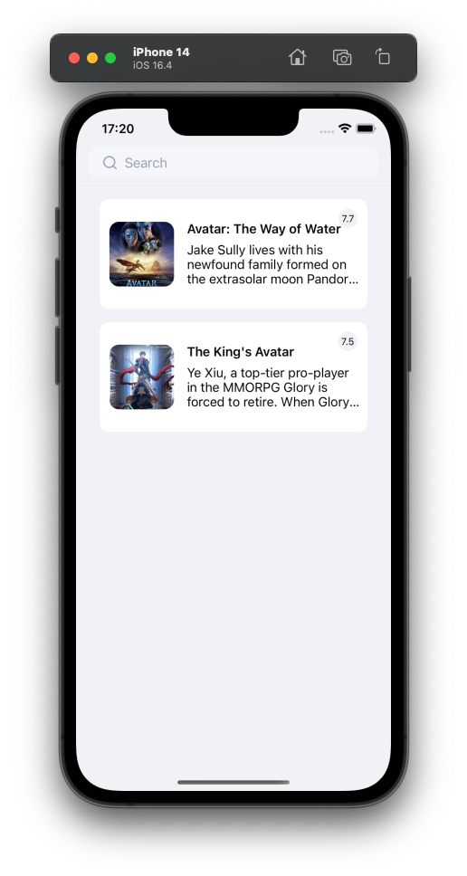
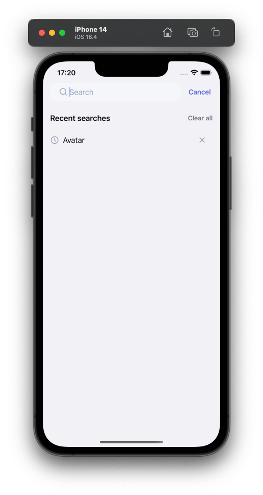
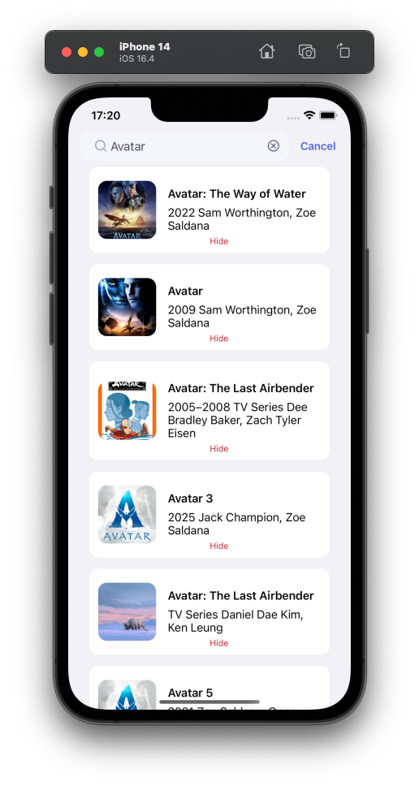
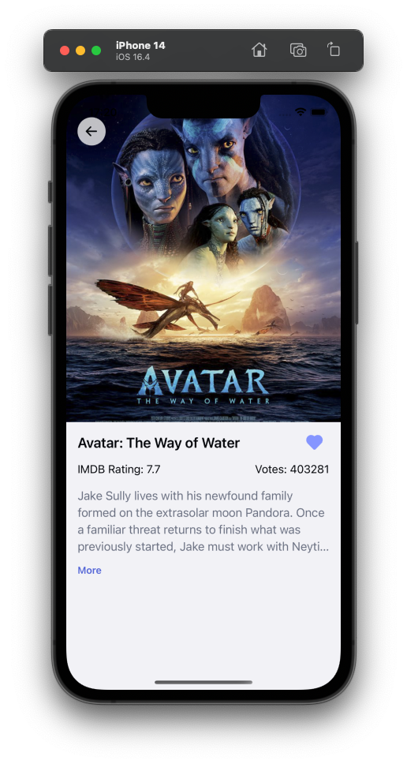

# my-movies-app

A simple react native project that consists of:
1) A home page with a list of favourite movies/show, and a search header to navigate to search screen.
2) Click the movie/show to navigate to the entity's page. There you can see the basic info of the entity.
   1) Poster image
   2) Title
   3) Description
   4) Rating & Number of votes
   5) Favourite button with the appropriate functionality.
3) At search screen you can search using the [imdb's API](https://imdb-api.com/api), and then click to navigate to the entity's page.
4) Recent searches are saved locally and can be chosen by the user in the suggestion list.
5) Hide entities from search results.

## Notes
- Imdb api doesn't have pagination, thus no infinite scroll was implemented on the search list.
- The api allows 100 requests per day per api key. There are 2 api keys in the env file that can be used to test the project.
- The rating of each movie is appeared on the top right as a pill when we are in a list.
  - This is possible by saving the whole entity into favourites.
  - In search list this is not possible, because imdb's api will not return the rating for each 'Title'.
- Uses styled-components
- Tested on iOS devices.

## Environment
```shell
"npm": "8.11.0", # Globally installed
"node": "^16", # Globally installed
"yarn": "1.22.19", # Globally installed
"@react-native-async-storage/async-storage": "^1.17.7",
"@react-native-community/netinfo": "^9.3.0",
"@react-navigation/elements": "^1.3.3",
"@react-navigation/native": "^6.0.10",
"@react-navigation/native-stack": "^6.6.2",
"@reduxjs/toolkit": "^1.8.2",
"@shopify/restyle": "^2.1.0",
"axios": "^1.4.0",
"lodash.debounce": "^4.0.8",
"react": "18.2.0",
"react-native": "0.72.3",
"react-native-config": "^1.5.1",
"react-native-device-info": "^9.0.2",
"react-native-flash-message": "^0.2.1",
"react-native-reanimated": "^3.3.0",
"react-native-safe-area-context": "^4.5.3",
"react-native-screens": "^3.21.0",
"react-native-vector-icons": "^9.2.0",
"react-query": "^3.39.1",
"react-redux": "^7.2.8",
"redux-flipper": "^2.0.1"
```

## Install dependencies

```shell
nvm use 16
npm install --global yarn # Or use npx before each yarn command

# Install dependencies, start metro bundler and build app
yarn clean-start
# click `i` to run iOS or run the following command
yarn ios # Will run application to latest iPhone mini simulator
```

## App functionality

### Home screen

### Search screen

### Results

### Movie details screen

